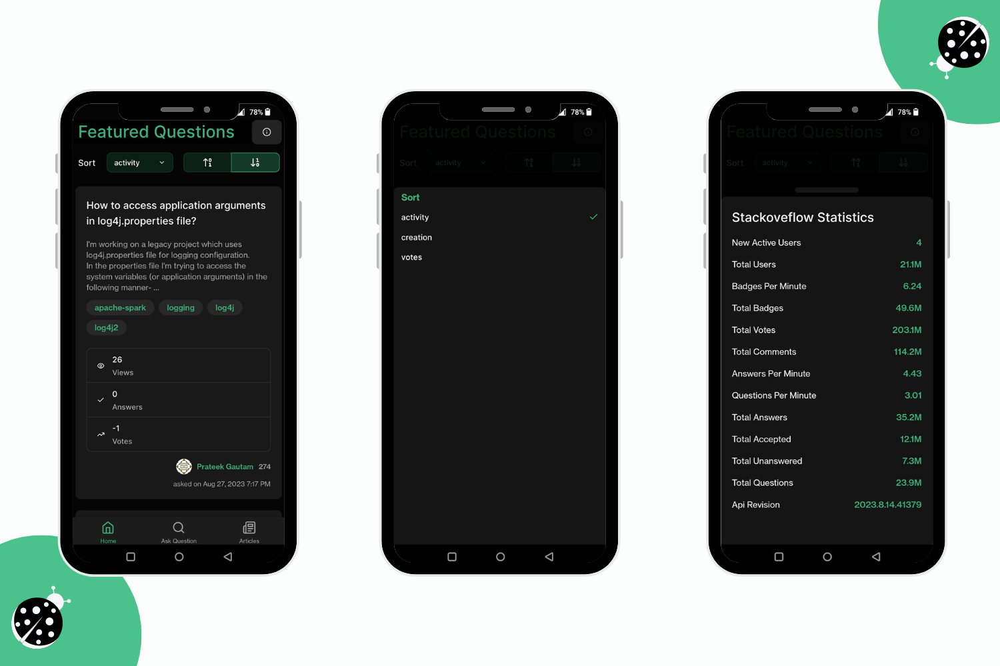
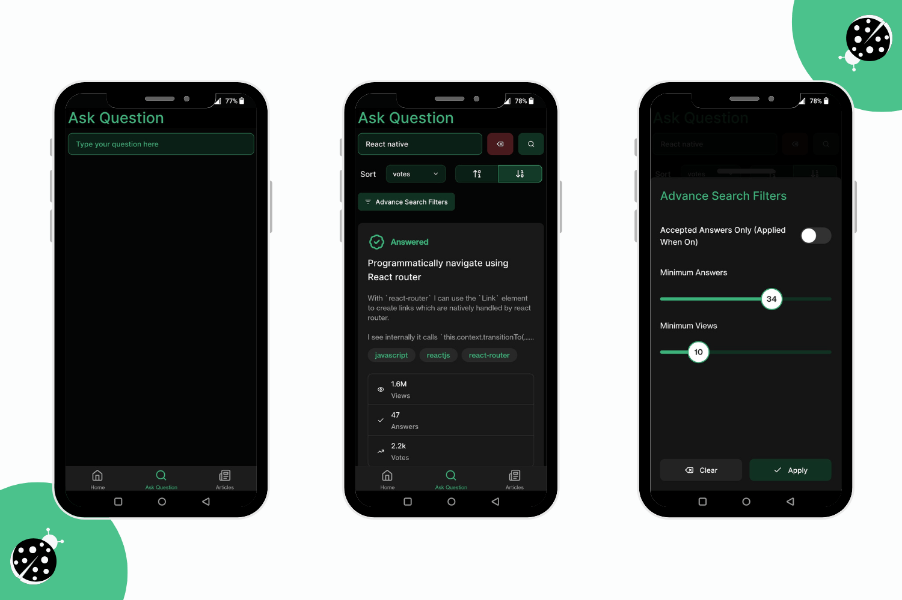
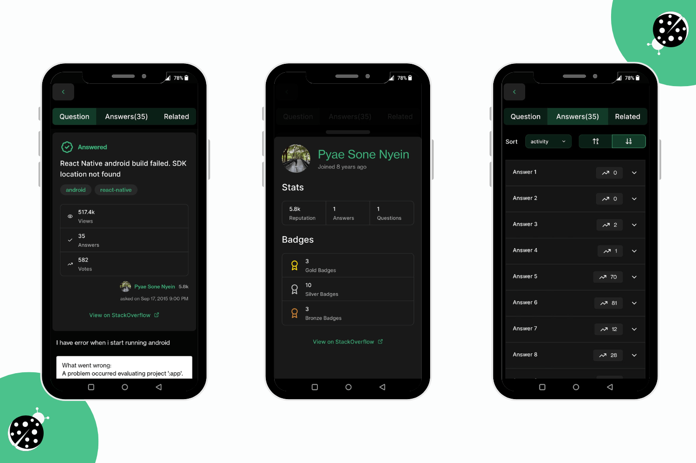
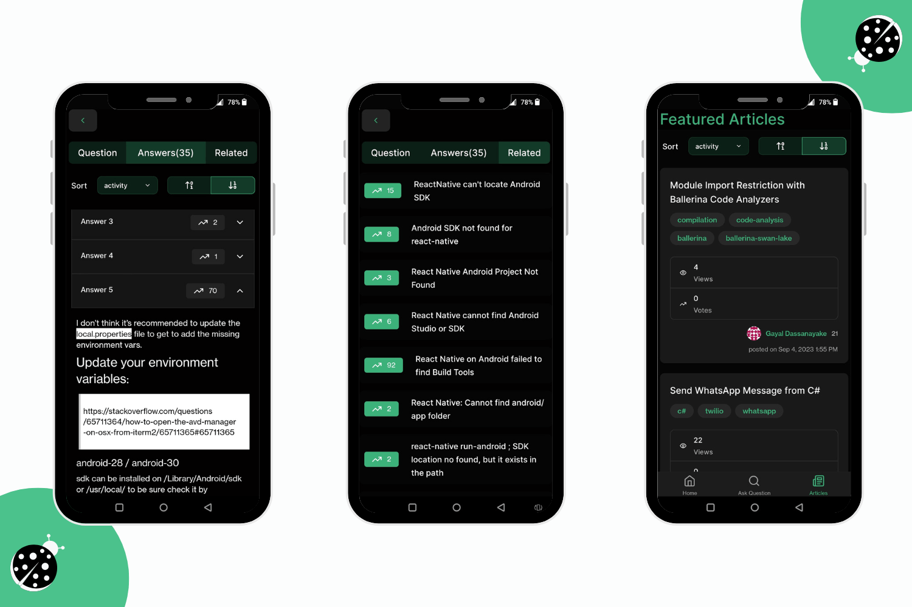
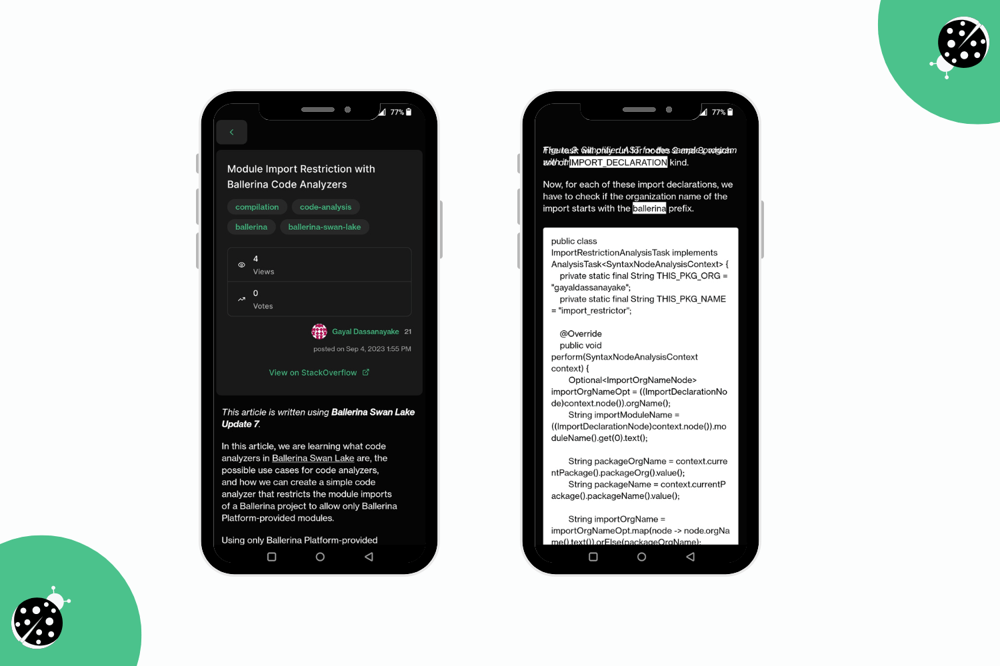
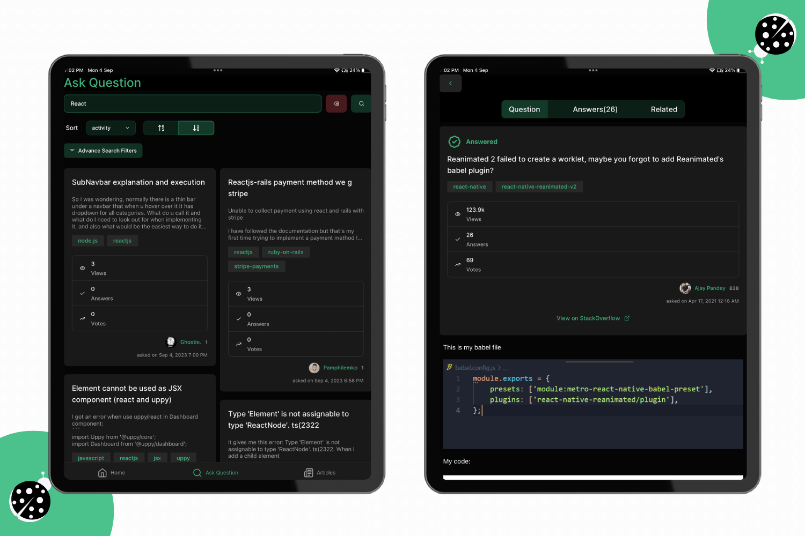

# BugBridger (StackOverflow Mobile App)

## Table of contents

- [Overview](#overview)
- [Screenshots](#screenshots)
- [Run the project](#run-the-project)
- [Built with](#built-with)

## Overview

- Discover featured questions effortlessly on the home tab, elegantly presented in card format.
- Each question card provides essential details such as the question title, description, tags, and key statistics like view count, answer count, and votes.
- Get insights into the user who posted the question, with the option to tap for in-depth user information, including their name, joining date, reputation, and badges.
- Effortlessly search for specific questions using the search bar, complete with advanced search filters and sorting options for tailored results.
- Simply tap on any question card to access the dedicated question screen, offering comprehensive information about the question and all associated answers.
- Enjoy proper code and text formatting with Markdown support, ensuring readability of coding blocks.
- Quickly identify accepted answers for optimal problem-solving.
- Explore the entire Stack Overflow repository, including both questions and answers, with a single button press.
- Discover a collection of articles from Stack Overflow within the dedicated "Articles" tab, with the added convenience of sorting options.

## Screenshots

<div>
  
  
  
  
  
  

</div>

## Run the project

First you need to have node and Android Studio install in your machine to run this project and app.
Clone this project and open it on any Code Editor or IDE.
Then run this command.

```
npm i
```

It will install all the dependencies in your system. Then run this command to start the server.

```
npm start
```

Now you can view this app on your Android smartphone or Android Emulator

## Built with

- React Native
- Expo 49
- Typescript
- tamagui
- expo-router
- [Stack Exchange API](https://api.stackexchange.com/docs)
- Shopify Flashlist and MasonryFlashList
